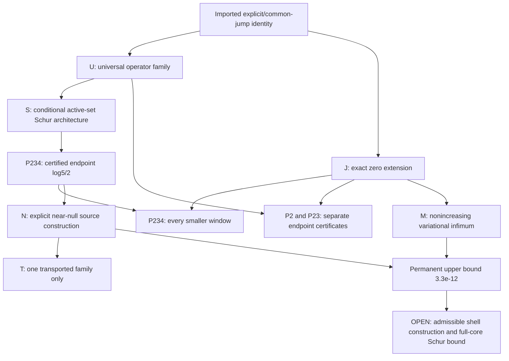

# Theorem inventory and scope

**AUTHOR-DERIVED / EXTERNAL-REVIEW-OPEN.** Target: `fc597f6129db57787c85ec20627ed608233187ba`.

Let
\[
\mathcal W_a=H^1_0((-a,a);\mathbb C)\cap\ker E_+\cap\ker E_-,
\qquad E_\pm u=\int_{-a}^a u(x)e^{\pm x/2}\,dx.
\]
There are exactly two GLOBAL conditions. Even parity uses the cosh
condition and odd parity the sinh condition. The form Q_W is the
imported common-jump Weil form, with the normalization recorded in
DEPENDENCIES.md. None of the following is an external audit.

| ID | Precise result | Source package / evidence |
|---|---|---|
| U | On each bounded window, q_a=D_H+V+q_0(a)I-K_a-sum_q Lambda(q)/sqrt(q) T_(log(q)/a), with every active prime power; no positivity for arbitrary a follows from this identity. | universal-prime-power-family-2026-09-18, PROOF.md; 349 finite algebra regressions supplement the analytic proof. |
| J | Physical zero extension is isometric, preserves H1_0, transports the two moments, and preserves the full form. One positive endpoint therefore covers every smaller window. | Universal family §§1,5 and prime2 interval §10. |
| S | For any finite active set, complete mixed-shift Parseval Grams, positive infinite tail, a model-error bound and positive finite Schur certificate imply an actual source gap after the inverse shear and final division by 1+beta. | active-set-segment-schur-2026-09-18 §§2-6; 381 rational algebra checks. This is a CONDITIONAL theorem, not all-active-set positivity. |
| P2 | Q_W[u]>10^-5 ||u||^2 for every nonzero u in W_a and 0<a<=log(3)/2. | prime2-interval-continuation-2026-09-18; 22 arithmetic groups. |
| P23 | Q_W[u]>10^-11 ||u||^2 for every nonzero u in W_a and 0<a<=log(2). | prime3-transition-unified-shifts-2026-09-18; 23 groups. |
| P234 | Q_W[u]>10^-13 ||u||^2 for every nonzero u in W_a and 0<a<=B=log(5)/2. | prime-power-segment-4-2026-09-18; 15 groups. Channels 2,3,4; w_4=log(2)/2; channel 5 has zero overlap at B. |
| N | An explicit even H1_0 source with exactly zero Mellin moments at B has Rayleigh quotient in the directed interval below. | Same endpoint package and near-null-source-transport-2026-09-18; separate integration, shared arithmetic primitives, not independent external review. |
| M | lambda_e, lambda_o and the full infimum are nonincreasing under window inclusion. Hence lambda_e(b)<3.3e-12 for b>=B, with no lower bound asserted there. | window-gap-monotonicity-2026-09-18 §§1-4; 5 checks bind only the numerical corollary. Section 5's shell decomposition is NOT included as a proved theorem; see OPEN_PROBLEMS.md. |
| T | One specified dilated, exactly moment-corrected family has Rayleigh quotient >10^-12 throughout [B,log(7)/2]. Channel 5 lowers its energy strictly for a>B. | near-null-source-transport-2026-09-18; 27 groups, 435 exact Gamma identities and rational Taylor covers. This is NOT an all-source theorem beyond B. |

For N, the higher-precision enclosure is
\[
3.296290826616004472\,10^{-12}
\le R_B\le
3.296290826616004499\,10^{-12}.
\]
An upper bound on one source is an upper bound on the infimum, not a
uniform reserve for all sources. At B the certified even lower bound
is >1.04238900475e-13 and the certified odd lower bound is
>2.383164924426e-11. These are compatible with N.

The endpoint certificates include the entire infinite tails, actual
moment-map errors, the inverse shear norm and division of the entire
back-transformed lower bound by 1+beta. A finite matrix on its own is
not their proof. T's additional tail calculation is a *directional*
audit at cutoffs 63,79,95, not a fresh audit of every endpoint matrix
entry. Direct source energy does not incur those certificate losses a
second time.

The arrows denote logical/analytic organization, not imported numerical
gaps: P234 recomputes its endpoint and does not assume P2 or P23's
positive numbers. N uses coefficients deposited by P234 but its direct
energy is evaluated separately. M requires neither positive tail
estimates nor a spectral minimizer nor the proposed shell split.
